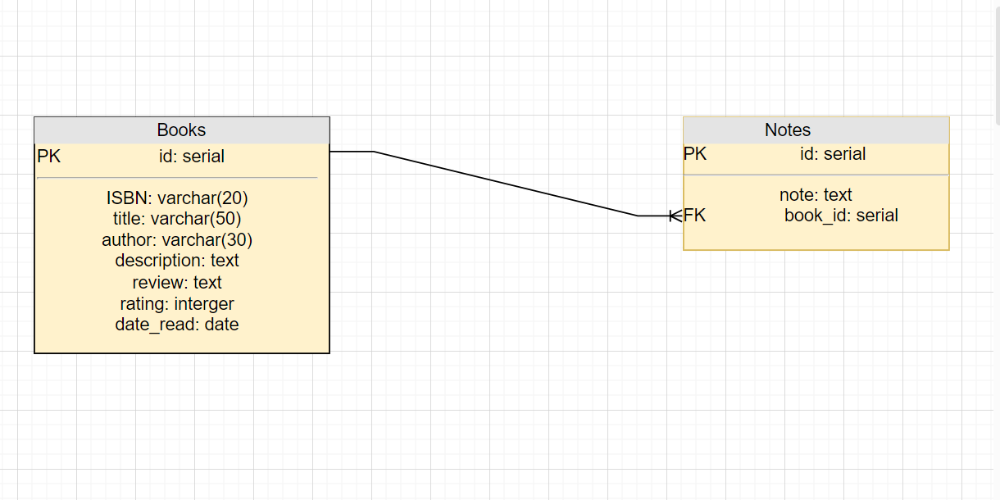
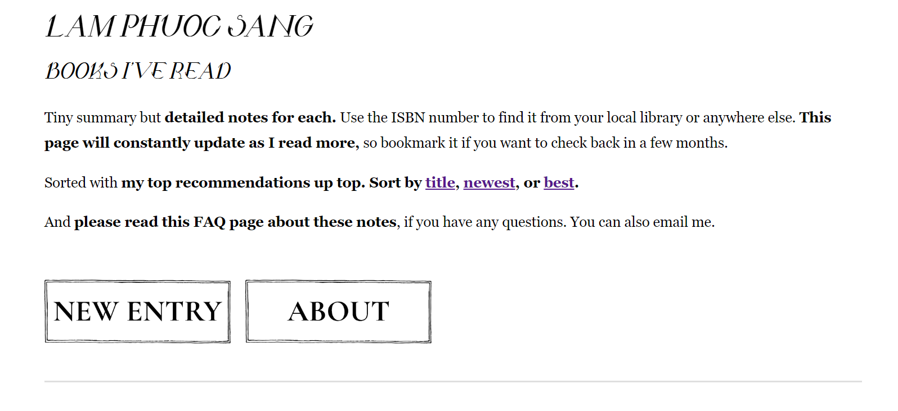
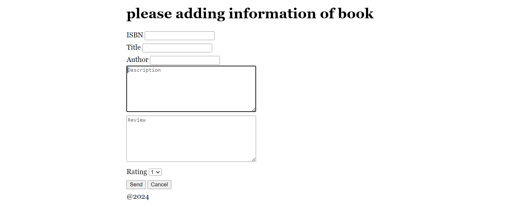
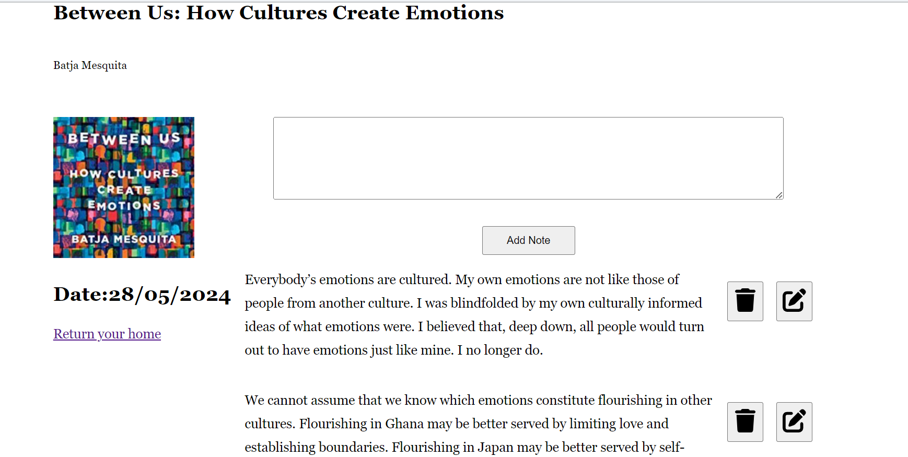

# My BookNotes project. 

# install nodejs by using commant:
1. npm i 
2. npm i nodemon

# run project
nodemon index.js

# Entity tables database

# API Interaction
* When submitting a new book entry, cover images are fetched from the [Open Library Covers API](https://openlibrary.org/dev/docs/api/covers) using Axios. A `getBase64Image` function fetches the image and save them to DBMS.

# Access the website in your browser
`http://localhost:3000`

# Some pictures from my page 
1. Header of the page

2. Book entries with `View Notes`, `Delete Book`, `Update Review` features

3. Adding a new book with the information of the book

4. Notes listing including `Add Note`, `Update Note`, `Delete Note` features
 